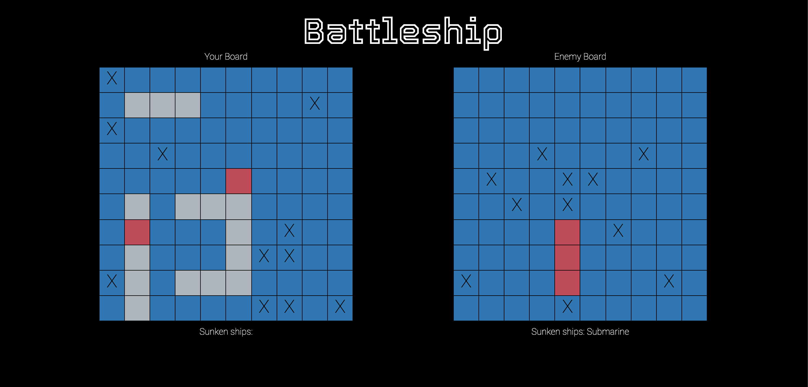

# Battleship 
Following project guidelines listed in [The Odin Project](https://www.theodinproject.com/paths/full-stack-javascript/courses/javascript/lessons/battleship) JavaScript curriculum, this version of the classic game, _Battleship_, has a person playing against the enemy computer by taking turns placing a "hit" on each other's gameboard.  To win the game, the person will need to click on different squares of the enemy gameboard, hoping to eventually hit and sink all five of the randomly placed ships before their own ships sink.

[Live Demo](https://raych2.github.io/battleship/)

## Purpose
The purpose of this project is to implement Test Driven Development (TDD).  Having previously relied on the use of multiple `console.log()` statements and the debugger to make sure my code was working the way I had intended, the tests I had written for the game logic using Jest proved to be the more efficient method in the long run.  Any tests that failed led me to go back and improve the code, so that the tests would pass.

## Future Updates
* Implement drag and drop, so a player can place their own ships
* A more intelligent computer opponent

## Technologies Used
* HTML, CSS, JavaScript
* [Webpack](https://webpack.js.org/)
* [Jest](https://jestjs.io/)
* [Babel](https://babeljs.io/)
* [ESLint](https://eslint.org/)
* [Prettier](https://prettier.io/)
